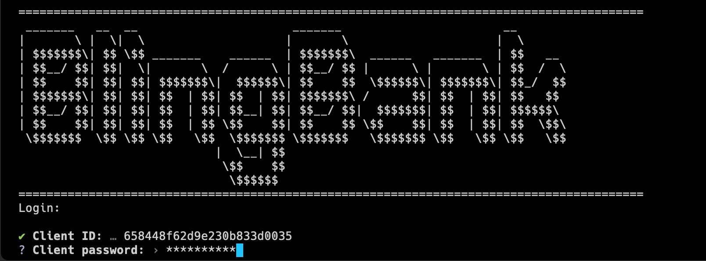
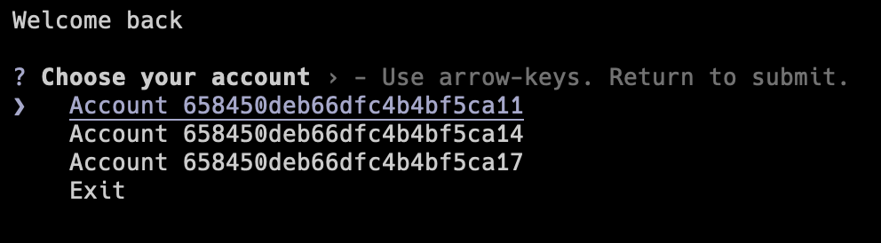
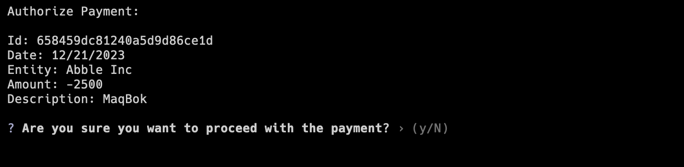
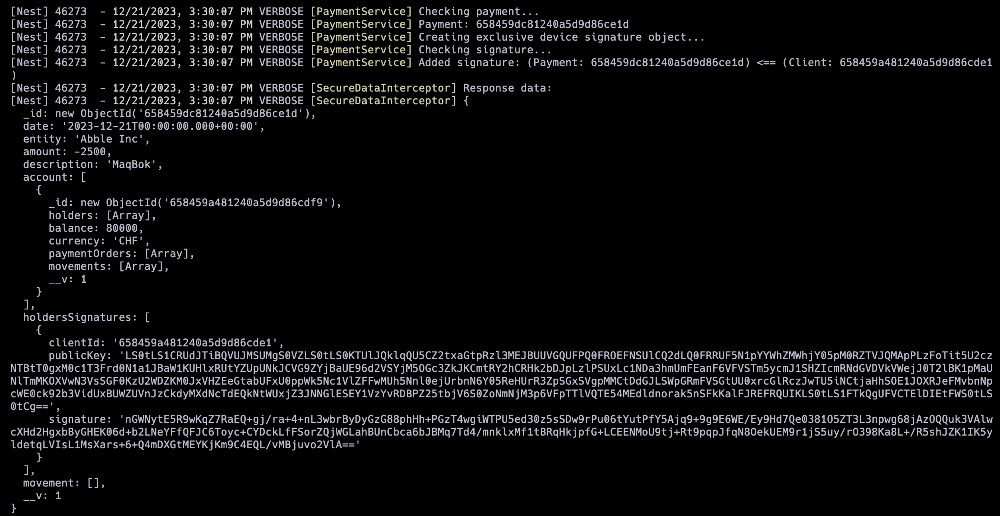
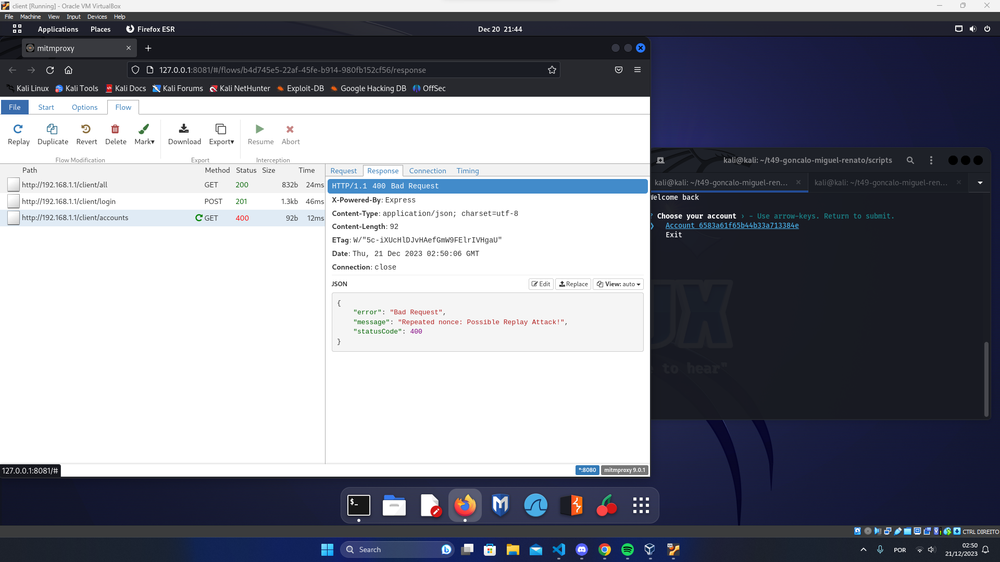
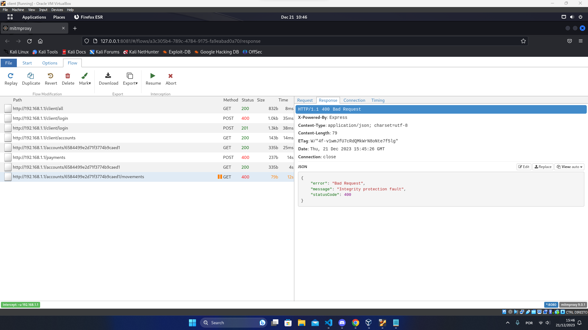
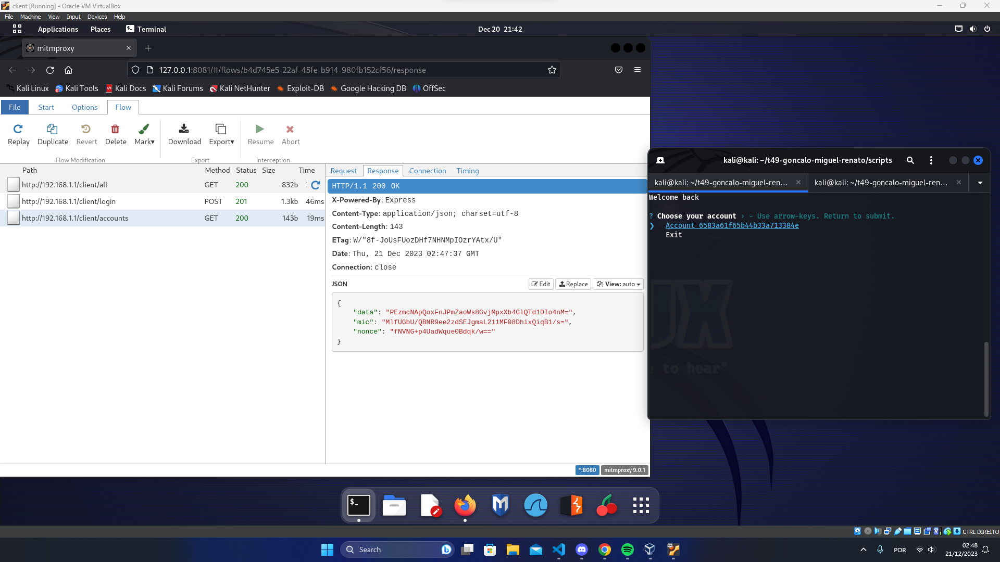
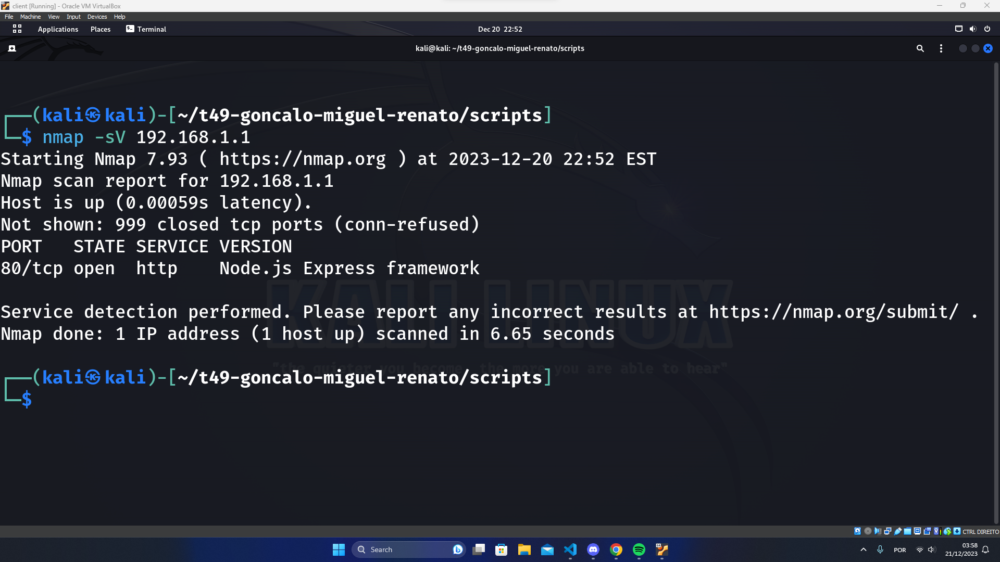

# T49 BlingBank Project Read Me

<!-- this is an instruction line; after you follow the instruction, delete the corresponding line. Do the same for all instruction lines! -->

## Team

| Number | Name              | User                             | E-mail                              |
| -------|-------------------|----------------------------------| ------------------------------------|
| 110948  | Renato Custódio     | <https://github.com/Renato-Custodio>   | <mailto:renato.miguel.monteirinho.custodio@tecnico.ulisboa.pt>   |
| 96925  | Gonçalo Silva      | <https://github.com/goncaloacbsilva>     | <mailto:goncalo.c.brito.da.silva@tecnico.ulisboa.pt>     |
| 99113  | Miguel Vale | <https://github.com/MiguelVale2121> | <mailto:miguel.vale@tecnico.ulisboa.pt> |

  

## Contents

This repository contains documentation and source code for the *Network and Computer Security (SIRS)* project.

The [REPORT](REPORT.md) document provides a detailed overview of the key technical decisions and various components of the implemented project.
It offers insights into the rationale behind these choices, the project's architecture, and the impact of these decisions on the overall functionality and performance of the system.

This document presents installation and demonstration instructions.

## Installation

To see the project in action, it is necessary to setup a virtual environment, with 3 networks and 5 machines.  

The following diagram shows the networks and machines:


### Prerequisites

All the virtual machines are based on: Linux 64-bit, Kali 2023.3  

[Download](https://cdimage.kali.org/kali-2023.4/kali-linux-2023.4-installer-amd64.iso) and [install](https://www.kali.org/docs/installation/hard-disk-install/) a virtual machine of Kali Linux 2023.3.  

When using VirtualBox in Windows the Hyper-V has to be **disabled**

### Machine configurations

For each machine, there is an initialization script with prefix `config` and suffix `.sh`, that installs all the necessary packages and makes all required configurations in the a clean machine.

To simplify the setup process we also have a script called `setup.sh` that should be used to configurate all the machines. This script presents the user with several options one for each machine.

Inside the machine from which we make the linked copies, use Git to obtain a copy of all the scripts and code. This way we only need to clone the repository once.

```sh
$ git clone https://github.com/tecnico-sec/t49-goncalo-miguel-renato.git
```

Next we have custom instructions for each machine.

#### Machine 1 (Border Router)

1. Network tab in VirtualBox:

    **Adapter 1:**
    - Attached to: `Internal Network`
    - Name: `dmz`
    - Advanced Settings:
      - Promiscuous Mode: `Allow VMs`

    **Adapter 2:**
    - Attached to: `Internal Network`
    - Name: `outnet`
    - Advanced Settings:
      - Promiscuous Mode: `Allow VMs`

    **Adapter 3:**
    - Attached to: `NAT`

2. Run machine setup:

    ```sh
    $ chmod +x setup.sh
    $ ./setup.sh
    ```
3. Select option `4) Border Router`

#### Machine 2 (Inner Router)

This machine runs the inner router

1. Network tab in VirtualBox:

    **Adapter 1:**
    - Attached to: `Internal Network`
    - Name: `dmz`
    - Advanced Settings:
      - Promiscuous Mode: `Allow VMs`

    **Adapter 2:**
    - Attached to: Internal Network
    - Name: `db`
    - Advanced Settings:
      - Promiscuous Mode: `Allow VMs`

2. Run machine setup:

    ```sh
    $ chmod +x setup.sh
    $ ./setup.sh
    ```

3. Select option `5) Inner Router`

Sometimes the setup crashes because the network is still being set so the solution is to run the set up again.

#### Machine 3 (Server)

This machine runs the server that runs in nodejs

1. Shared folders tab in VirtualBox:
  - Add an empty shared folder called Keys and auto-mount it.

2. Network tab in VirtualBox:

    **Adapter 1:**
    - Attached to: `Internal Network`
    - Name: `dmz`
    - Advanced Settings:
      - Promiscuous Mode: `Allow VMs`

    ```sh
    $ chmod +x setup.sh
    $ ./setup.sh
    ```
3. Select option `3) server`

Sometimes the setup crashes because the network is still being set so the solution is to run the set up again.

#### Machine 4 (Database)

This machine runs the database which runs in mongo

1. Network tab in VirtualBox:

    **Adapter 1:**
    - Attached to: `Internal Network`
    - Name: `db`
    - Advanced Settings:
      - Promiscuous Mode: `Allow VMs`

    ```sh
    $ chmod +x setup.sh
    $ ./setup.sh
    ```

2. Select option `2) Database`

Sometimes the setup crashes because the network is still being set so the solution is to run the set up again.

#### Machine 5 (Client)

This machine runs the client in nodejs.

1. Shared folders tab in VirtualBox:
  - Add an empty shared folder called Keys and auto-mount it.

2. Network tab in VirtualBox:

    **Adapter 1:**
    - Attached to: `Internal Network`
    - Name: `outNet`
    - Advanced Settings:
      - Promiscuous Mode: `Allow VMs`

    **Adapter 2:**
    - Attached to: `NAT`

    ```sh
    $ chmod +x setup.sh
    $ ./setup.sh ("select the option client")
    ```

3. Select option `1) Client`

Sometimes the setup crashes because the network is still being set so the solution is to run the set up again.

## Demonstration

For testing purposes we have an endpoint in our server to retrieve all of the clients info, this way we can see the client ids that we need to perform the login.<br>
The command used for this is `curl http://192.168.1.1/client/all | jq .` and it returns an output with the format
```
[
  {
    "_id": "",
    "name": "",
    "password": "",
    "accounts": [
      ...
    ],
  },
  ...
]
```

### Features:
#### Authentication:
Our project features a secure authentication system that allows clients to login from any device using their crendentials and establish a secure session. The secure session is established with an initial change of asymmetric keys between the cli and the server.

*Login Prompt*

*Server logs*


#### Management of multiple accounts:
Our highly flexible data models allow clients to manage multiple accounts. These accounts can also be shared among multiple holders.


#### Secure payments involving shared accounts:
The payments system was designed to provide secure payment approvals by using client individual device signatures. This way account holders can approve payments from any device and their digital signatures can be later verified by the server.<br>
*Authorize Payment Prompt*

*Server logs*


To demonstrate our security mechanisms we performed a Man-in-the-Middle (MitM) and for that purpose we used mitmproxy that is an open-source, interactive, and customizable proxy server designed for inspecting, modifying, and intercepting HTTP and HTTPS traffic. We configured a proxy in the client with the url localhost and the port 8080 so that we could redirect the http traffic to mitmproxy. We performed replay attacks with POST requests like create payment and also with GET requests like login and obtained the following results:

*Attempt of a replay attack*


Then we intercepted the traffic from the client using mitmproxy with interception filter `~u 192.168.1.1` and attempted to tamper some fields in the packets like the nonces and the data. By doing this we obtained the following responses from the server:

*Attempt of a MITM packet interception attack (during POST request)*


*Attempt of a MITM packet interception attack (during GET request)*


It is also important to note that during all this attacks the data traded between the client and the server was always kept confidential.



For our last attack we decided to perform service recognition with a port scan attack to test the firewall of the border router. Which gave us the output below:



This means that the firewall is properly configured by only accepting traffic at the TCP port 80 and blocking other incomming connections.

## Additional Information

### Links to Used Tools and Libraries

#### Base stack:
- [NodeJS](https://nodejs.org/)
- [TypeScript](https://typescriptlang.org)

#### Server:
- [Cache Manager](https://www.npmjs.com/package/cache-manager)
- [Class Validator](https://www.npmjs.com/package/class-validator)
- [Class Transformer](https://www.npmjs.com/package/class-transformer)
- [Luxon](https://moment.github.io/luxon/)
- [MongoDB](https://www.mongodb.com/)
- [Mongoose](https://mongoosejs.com/)
- [NestJS](https://nestjs.com/)

#### Client:
 - [Prompt](https://www.npmjs.com/package/prompts)
 - [Axios](https://www.npmjs.com/package/axios)

#### Iptables:
 - [Nat configuration](https://www.digitalocean.com/community/tutorials/how-to-forward-ports-through-a-linux-gateway-with-iptables)

### License

This project is licensed under the MIT License - see the [LICENSE.txt](LICENSE.txt) for details.
----
END OF README