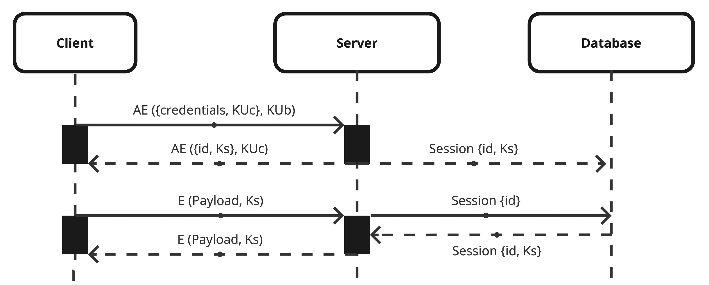

# C49 BlingBank Project Report

## 1. Introduction

Our project, BlingBank, is a contemporary digital financial platform built on the principles of security, accessibility and convenience. Providing an online banking platform accessible via an intuitive CLI application.<br>
To ensure the safety of the platform a secure library was designed to supply methods that guarantee confidentiality, authenticity, and non-repudiation of each operation.<br>
The platform infrastructure is divided into three main layers and two main virtual networks:
- OUTNET: Public network that receives incomming connections by the client layer
- DMZ: Private internal network protected by a border router that contains all the traffic generated between the server and the database layers.
  
To enforce a layer based protection there's also an internal router that isolates the databases from the DMZ traffic.


## 2. Project Development

### 2.1. Secure Document Format

#### 2.1.1. Design

For the first version of our security library we implemented symmetric key based methods, since the initial requirements only accounted with a symmetric key shared among entities. We also had to ensure data authenticity and confidentiality.<br>

**Authenticity:**<br>
For providing authenticity we developed the methods `secureHash` and `micMatch` that generate and validate *SHA256* base64 encoded hashes (MICs). In this case we opted to not use *HmacSHA256* since an attacker could only generate a MIC if he also managed to decrypt the document data (compromise confidentiality) using the symmetric key that would also be used for generating a MAC.<br>

**Confidentiality:**<br>
For providing confidentiality we developed the methods `cipherData` and `decipherData` that encrypt and decrypt the document data using an AES-256-CBC algorithm. The 256-bit key size provides a large number of possible key combinations, making it computationally impossible to break through brute force attacks. Additionally, the CBC mode introduces a level of diffusion, where each block of plaintext depends on the previous block, enhancing the overall security of the encryption. To generate the initialization vector (IV) required by these functions we use data from `randomBytes` function which is a cryptographically strong pseudo-random data generator provided by the NodeJS `crypto` module.<br>

By combining these two security mechanisms we reach the secure document format displayed below. <br>
In the encryption process a secure IV will first be generated by `randomBytes` and saved in the `iv` field. This IV is the passed along with the symmetric key and the document data to `cipherData` which will produce the base64 encoded ciphered content that will be saved in the `data` field. Finally a MIC will be generated using the plain version of the data along with the IV and saved to the `mic` field. <br>
When decrypting we simply check the protected document integrity and authenticity by using `micMatch` and then decrypt its data with `decipherData`
```typescript
export interface ProtectedDocument {
  mic: string;
  iv: string;
  data: string;
}
```

#### 2.1.2. Implementation

In selecting the technology stack for this project, we opted for Node.js for its impressive performance and extensive library ecosystem. TypeScript was chosen to enhance code maintainability and reliability through type safety.<br>
The custom security library, securelib, was exclusively constructed leveraging the capabilities of Node.js's crypto module. This choice aligns with our commitment to robust security practices.<br>
Additionally, a Command Line Interface (CLI) was crafted to facilitate the protection, unprotection, and verification of documents, ensuring a user-friendly experience.

### 2.2. Infrastructure

#### 2.2.1. Network and Machine Setup

Our chosen infrastructure consists of five virtual machines (VMs): a client, a border router, a server, an inner router and a database. We have decided to implement a firewall on the border router between the client and the server and another firewall on the inner router between the server and the database.<br>

Regarding the technologies we are using for each server: For the database, we have opted for [MongoDB](https://www.mongodb.com/) due to its simplicity. It is a document-oriented storage system and not a SQL database, which means it offers more flexibility in handling different types of data. <br>
For the API server, we have chosen [NestJS](https://nestjs.com/) for its architecture, helping us organize our code into separate modules, and its support for [TypeScript](https://typescriptlang.org) and REST API's. We also the following additional libraries:
- [Mongoose](https://mongoosejs.com/): A schema-based solution to model our application data and build our database queries
- [Luxon](https://moment.github.io/luxon/): Library for working with the Datetime objects used across our project (Account movements dates, Payments dates, Nonces renewing intervals)
- [Class Validator](https://www.npmjs.com/package/class-validator) and [Class Transformer](https://www.npmjs.com/package/class-transformer): For validating and parsing Data Transfer Objects (DTOs)
- [Cache Manager](https://www.npmjs.com/package/cache-manager): Caching module for NodeJS. Utilized by our server replay attack protection to track expired nonces.<br>

For the client side, we used a simple NodeJS app along with [Prompt](https://www.npmjs.com/package/prompts) for its user interaction capabilities and [Axios](https://www.npmjs.com/package/axios) for its straightforward approach to making HTTP requests.<br>

#### 2.2.2. Server Communication Security

In our system, both the client and server initiate communication with an established shared secret key, acting as a cryptographic foundation for safeguarding information. To seamlessly manage encryption, decryption, and associated verification processes within our server, we've meticulously implemented an interceptor class.<br> 

For securing the communication channel between our server and the database, we've implemented TLS encryption. This cryptographic protocol ensures the fundamental principles of confidentiality, integrity, and authenticity in transmitting data across the network.<br>

However, a notable challenge in this project arose during the integration of our secure library into the interceptor class. The complexity became apparent when the encryption of payloads commenced, making it challenging to discern the content of these encrypted payloads. Consequently, the identification and resolution of errors became intricate due to the obscured nature of the payload data.<br>

Additionally, the generation of necessary certificates for TLS communication posed a formidable challenge. The process was intricate, with the complexity compounded by the interdependence of successive steps in certificate creation. Any error in this process necessitated a restart, underscoring the intricacy and delicacy of the certificate generation procedure.

### 2.3. Security Challenge

#### 2.3.1. Challenge Overview

1. The payment orders new document format forced us to re-design the way payment orders were initicially created, stored and approved.
2. Confidentiality, authenticity, and non-repudiation of each transaction forced us to generate asymmetric keys in order to sign all payment orders. We also re-designed what keys existed at the start and how the were exchanged.
3. Robust freshness measures to prevent duplicate executions of the order we had to implement a function that invalidated previously used nonces.
4. For accounts with multiple owners, e.g. Alice and Bob, require authorization and non-repudiation from all owners before the payment order is executed this forced us to store all users publick keys in order.

#### 2.3.2. Attacker Model

- Fully trusted: Account Owners, the individuals who own the BlingBank accounts and possess the corresponding private keys are fully trusted. Their private keys are crucial for signing payment orders, and their actions are assumed to be legitimate and authorized.
- Partially trusted: BlingBank Server, the server is partially trusted as it plays a central role in processing payment orders, maintaining account data, and facilitating key distribution. While the server is integral to the platform's functionality, trust is partial due to the potential risk of compromise or unauthorized access.
- Untrusted: External Adversaries, any external entities or individuals attempting to compromise the system, intercept communication, or gain unauthorized access are considered untrusted. This includes potential attackers with malicious intent who may attempt to exploit vulnerabilities in the system or compromise user accounts.

1. The attacker can send brute force attacks to discover the password of a client.
2. Compromising User Keys, if the attacker gains access to a user's private key, they could potentially sign fraudulent payment orders on behalf of the user. Protecting user keys and ensuring secure key distribution are crucial in mitigating this risk.
3. Eavesdropping, The attacker may have the capability to intercept communication between the user and the server. However, the use of asymmetric and symmetric cryptography ensures that the intercepted data remains confidential and unchanged.
4. The attacker can also compromise the API server, however the attack is mitigated due to the secure layer architecture employed by our system.

#### 2.3.3. Solution Design and Implementation


The UML sequence diagram dispayed above represent the secure communication process between a client and the BlingBank system:
1. The client encrypts his credentials and public key (KUc) with the server's public key (KUb) and sends this to the server.
2. The server decrypts this message with its private key (KSb), establishes a session, and sends back the session id and session key (Ks) encrypted with the client's public key (KUc).
3. The client then uses their private key (KSc) to decrypt this and now has a secure session key to communicate with the server.
4. After establishing a session the client starts sending encrypted data (payload) to the server using the session key (Ks). The server sends back responses, also encrypted with the session key (Ks).
The session key (Ks) is used for the duration of the session to maintain secure communication.
<br>

Once the login action is done the client and the server have a session key (symetric key) which they use to protect the information.<br>

Recognizing the imperative requirements for authenticity and non-repudiation, the decision to employ asymmetric keys was evident. Consequently, our security library underwent extension to seamlessly integrate and operate with these keys, ensuring the robust fulfillment of authentication and non-repudiation mandates.<br>

First we implemented `generateAsymmetricKeys()` followed by `encryptAsymmetricData()` and `decryptAsymmetricData()` but we were still missing the non-repudiation factor do we implemented `signData()` and `checkSignature()`. We also implemented `protectAsymmetricClient()`
and `protectAsymmetricServer()` these methods use `encryptAsymmetricData()` and `decryptAsymmetricData()` and create the payload that is exchanged between the server and the client.<br>

We redesigned the key destribution and now we use the public key of the server to encrypt the first payload or the login phase then the server responds with the session key and id that are encrypted using the public key of that client and from the onwards we use the session key because it is faster to decrypt using a symmetric key that an asymmetric one, so this also make our program faster.
Our payment orders now not only include all the necessary data to make a payment like date, entity, amount, description and accountId but also the holdersSignatures and a state for example completed. This allows us in the accounts with multiple holders to check if everyone has signed. All of this is done by a method in the server side that using the public key recived from a client checks whether the signatures are valid or not and approves the payment.<br>

## 3. Conclusion

BlingBank implements advanced security measures. Achievements include the introduction of a secure payment order format ensuring confidentiality, authenticity, and non-repudiation. Multi-owner authorization, freshness measures, and dynamic key distribution further enhance transaction security. The project successfully balances user-friendly accessibility with robust protection of account data.<br>

All of the functionalities (account management, expense monitoring, and payments) were implemented.<br>
Authenticity and confidentiality and non-repudiation, all of these requirements are satisfied because we encrypt all of our important data and sign all of our transactions.<br>

Robust freshness was satisfied since we create a random nonce when generating our mics and macs.<br>
We could implement a mechanism to handle brute force attacks like implementing an account lockout mechanisms that temporarily locks the user accounts after a certain number of failed login attempts or defining a threshold for unsuccessful login attempts (e.g., 3 to 5) before locking the account. We could also implement an intrusion detection mechanism (IDS) that could monitor network traffic and detect threats in our system, warning us so that we could mitigate them.<br>

Finally, the extended cryptographic library and infrastructure provide a robust solution for securing BlingBank's financial transactions. By ensuring confidentiality, authenticity, and non-repudiation of payment orders, as well as implementing measures to prevent duplicate executions and requiring multi-owner authorization, the platform offers a secure and reliable digital banking experience. The dynamic key distribution system enhances security by adapting to evolving cryptographic needs. This project reinforces the commitment to the principles of accessibility and convenience while prioritizing the protection of user data and financial transactions.<br>

## 4. Bibliography

1. K. Igoe, R. Housley, L. Thomas. (2003). *The AES-CBC Cipher Algorithm and Its Use with IPsec*. IETF RFC 3602. [Link](https://datatracker.ietf.org/doc/html/rfc3602)
2. Tony, Infisical. *Guide to Node's Crypto Module for Encryption/Decryption*. Medium. [Link](https://medium.com/@tony.infisical/guide-to-nodes-crypto-module-for-encryption-decryption-65c077176980)
3. Kalashin1. *Secure Your Data: Cryptography in Node.js*. Dev.to. [Link](https://dev.to/kalashin1/secure-your-data-cryptography-in-nodejs-1jeo)
4. Mongoose. *Mongoose Documentation*. [Link](https://mongoosejs.com/docs/)
5. Node.js. *Crypto - Node.js Documentation*. [Link](https://nodejs.org/api/crypto.html)
6. MongoDB. *Configure MongoDB for SSL — MongoDB Manual*. [Link](https://www.mongodb.com/docs/manual/tutorial/configure-ssl/)
----
END OF REPORT
